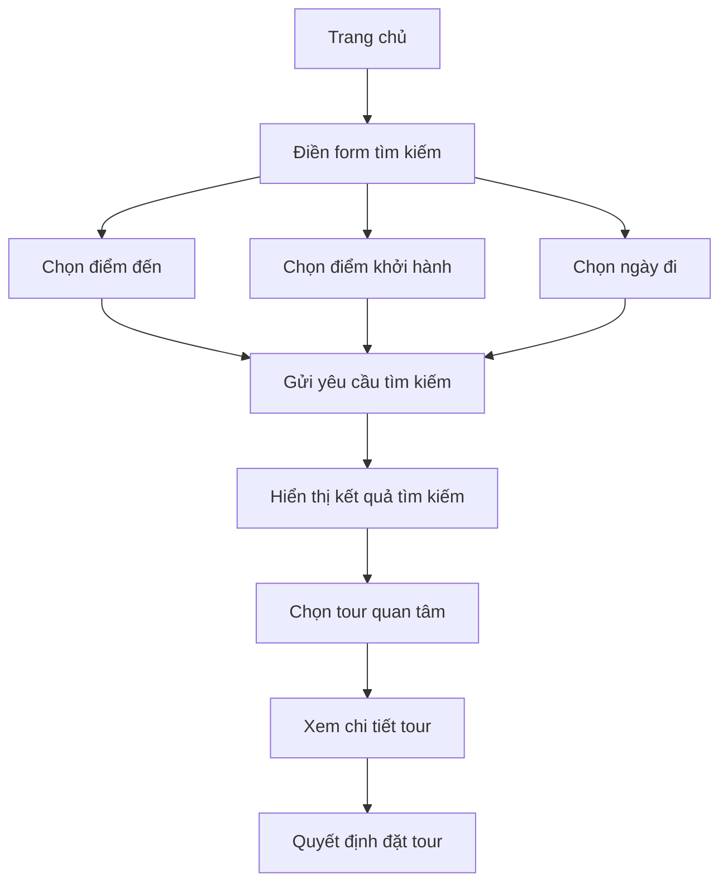
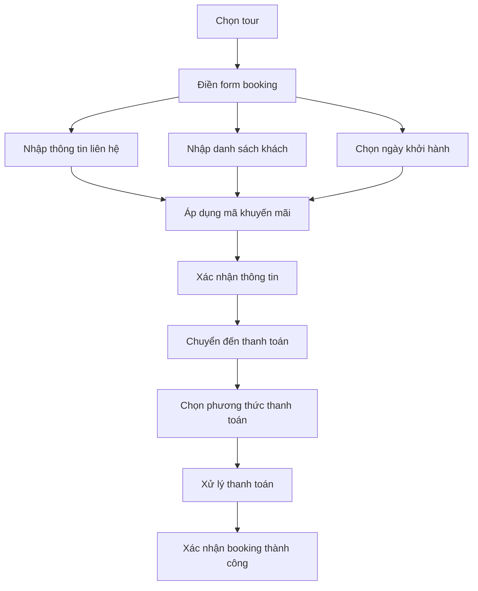
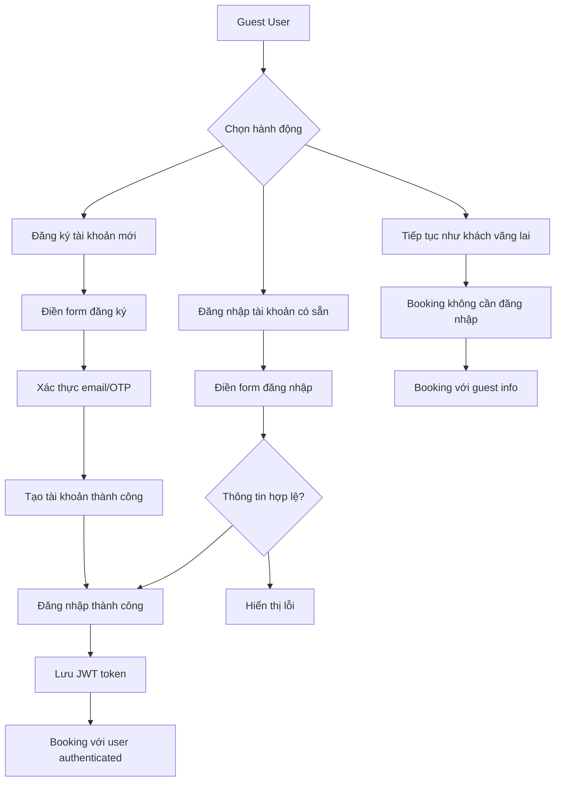
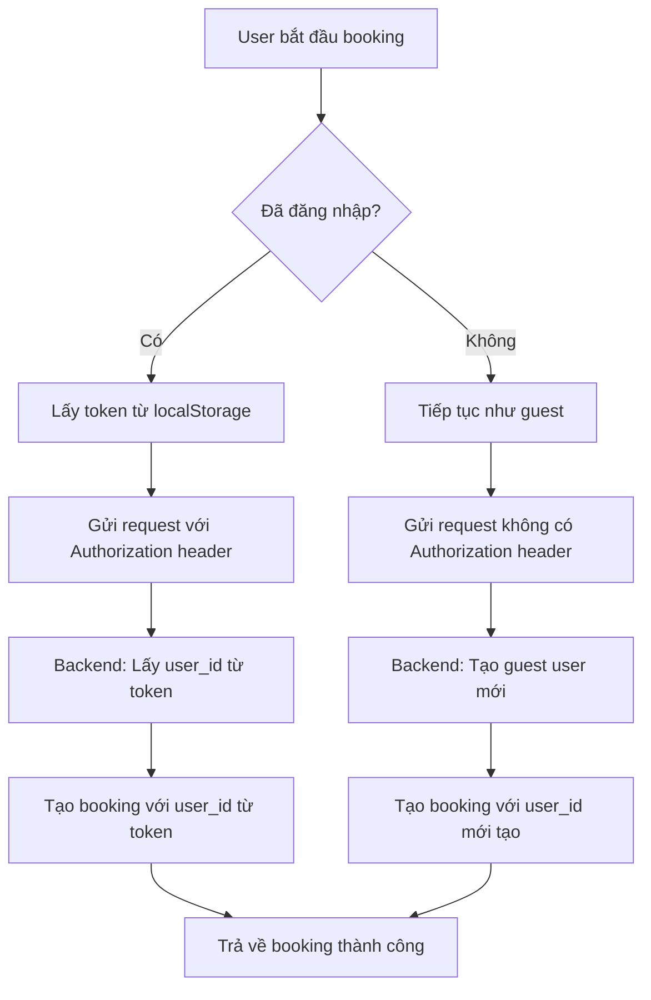

# User_UI - Travel Tour Booking Frontend System

## 🎯 Tổng quan dự án

Hệ thống đặt tour du lịch frontend được xây dựng trên **Next.js 15** với **TypeScript**, hỗ trợ đầy đủ luồng đặt tour từ tìm kiếm, đặt tour, thanh toán đến xác nhận booking cho cả khách hàng đã đăng ký và khách vãng lai.

## 🛠️ Công nghệ sử dụng

### 🔧 Công nghệ nền tảng
- **Next.js 15.2.4** - Framework React hiện đại với App Router
  - Server-side rendering (SSR) cho SEO tối ưu
  - Static site generation (SSG) cho tốc độ nhanh
  - API routes tích hợp sẵn
  - Image optimization tự động
- **React 19.1.0** - Thư viện JavaScript để xây dựng giao diện người dùng
  - Component-based architecture
  - Virtual DOM cho hiệu suất cao
  - Hooks pattern cho state management
- **TypeScript 5** - Ngôn ngữ lập trình có kiểu dữ liệu tĩnh
  - Type safety giảm lỗi runtime
  - IntelliSense tốt hơn trong IDE
  - Refactoring an toàn
- **Tailwind CSS 3.4.17** - Framework CSS utility-first
  - Responsive design dễ dàng
  - Dark mode support
  - Component variants linh hoạt

### 🎨 Thư viện giao diện và trải nghiệm người dùng
- **Radix UI** - Bộ thư viện component có tính truy cập cao
  - Dialog modals cho popup và form
  - Toast notifications cho thông báo
  - Select dropdowns với keyboard navigation
  - Navigation menus responsive
  - Accordion để hiển thị thông tin có thể thu gọn
- **Lucide React** - Bộ icon SVG hiện đại và nhẹ
- **Class Variance Authority** - Quản lý CSS classes theo variant
- **Tailwind Merge** - Tối ưu hóa CSS classes
- **React Hook Form** - Quản lý form hiệu quả
  - Validation tích hợp
  - Performance tối ưu với ít re-render
  - Type-safe với TypeScript
- **Zod** - Schema validation mạnh mẽ
  - Runtime type checking
  - Error messages tùy chỉnh

### 💳 Thanh toán và xác thực
- **QRCode.react** - Tạo mã QR cho booking confirmation
  - QR code chứa thông tin booking
  - Có thể scan để xem chi tiết tour
- **jsPDF** - Tạo file PDF cho hóa đơn booking
  - Font tiếng Việt support
  - Layout responsive
- **React Google reCAPTCHA** - Bảo mật chống bot và spam

### 📊 Hiển thị dữ liệu và tương tác
- **Recharts** - Thư viện biểu đồ cho analytics
  - Line charts cho thống kê booking
  - Bar charts cho doanh thu
- **Embla Carousel** - Slider hình ảnh mượt mà
  - Touch/swipe support cho mobile
  - Lazy loading images
- **Date-fns** - Xử lý ngày tháng
  - Format date theo locale Việt Nam
  - Tính toán khoảng thời gian
- **React Day Picker** - Component chọn ngày
  - Calendar picker cho ngày khởi hành
  - Disable ngày không khả dụng
- **Sonner** - Toast notifications đẹp và mượt

### 🔨 Công cụ phát triển
- **PostCSS** - Xử lý CSS với plugins
- **Autoprefixer** - Tự động thêm vendor prefixes
- **ESLint & TypeScript config** - Đảm bảo chất lượng code
  - Code formatting tự động
  - Error detection trong quá trình phát triển

## 🏗️ Kiến trúc hệ thống

### Cấu trúc thư mục
```
User_UI/
├── app/                      # Next.js App Router pages
│   ├── auth/                # Authentication pages
│   ├── booking/[id]/        # Dynamic booking pages
│   ├── confirmation/[id]/   # Booking confirmation
│   ├── payment-success/     # Payment success page
│   ├── search/              # Tour search page
│   ├── tour/[id]/           # Tour detail pages
│   └── api/                 # API routes
│       └── payment-callback/ # Payment gateway callbacks
├── components/              # React components
│   ├── auth.tsx            # Authentication component
│   ├── details/            # Booking flow components
│   │   ├── Booking.tsx     # Main booking form
│   │   ├── Payment.tsx     # Payment processing
│   │   ├── Confirmation.tsx # Booking confirmation
│   │   └── TourDetail.tsx  # Tour information display
│   ├── home/               # Homepage components
│   │   ├── hero-section.tsx # Search form
│   │   ├── popular-cities.tsx # Popular destinations
│   │   ├── alaska-showcase.tsx # Featured tours
│   │   └── footer.tsx      # Site footer
│   ├── search/             # Search results components
│   ├── ui/                 # Reusable UI components
│   └── state/              # State management components
├── services/               # API service layers
│   ├── tourService.ts      # Tour data operations
│   └── cancelTourService.ts # Tour cancellation
├── utils/                  # Utility functions
│   └── api.ts             # API call utilities
├── lib/                   # Business logic libraries
│   ├── commissionUtils.ts  # Commission calculations
│   └── promoCodeUtils.ts   # Promotion code handling
├── types/                 # TypeScript type definitions
│   └── tour.ts            # Tour data interfaces
├── hooks/                 # Custom React hooks
│   ├── useTour.ts         # Tour data management
│   └── useErrorHandler.ts  # Error handling
├── fonts/                 # Vietnamese font handling
└── docs/                  # Documentation
```

## 🔄 Luồng hoạt động chi tiết

### 1. 🔍 Luồng tìm kiếm Tour (Search Flow)



**📋 Chi tiết từng bước:**

**Bước 1: Form tìm kiếm trên trang chủ**
- **File:** `components/home/hero-section.tsx`
- **Chức năng:**
  - Dropdown chọn điểm đến (load từ API `/api/locations`)
  - Dropdown chọn điểm khởi hành (load từ API `/api/departure-locations/with-count`)
  - Date picker chọn ngày khởi hành
  - Button "Tìm kiếm" trigger search action

**Bước 2: Xử lý tìm kiếm**
- Gửi search log đến API: `POST /api/search/log`
- Redirect đến trang search với query parameters
- URL format: `/search?destination=DaNang&departure=HoChiMinh&startDate=2025-09-01`

**Bước 3: Hiển thị kết quả**
- **File:** `components/search/Search.tsx`
- **API calls:**
  - `GET /api/tours?limit=100` - Lấy tất cả tours
  - Client-side filtering theo tiêu chí tìm kiếm
  - Fallback data nếu API fail
- **Tính năng filter:**
  - Theo tên tour
  - Theo điểm đến
  - Theo điểm khởi hành  
  - Theo khoảng ngày
  - Theo giá tiền

**Bước 4: Xem chi tiết tour**
- **File:** `components/details/TourDetail.tsx`
- Click vào tour → redirect đến `/tour/[id]`
- Hiển thị đầy đủ thông tin: hình ảnh, mô tả, giá, lịch trình

### 2. 📝 Luồng đặt tour hoàn chỉnh (Complete Booking Flow)



**📋 Chi tiết từng bước:**

#### **Bước 1: Form đặt tour**
**File:** `components/details/Booking.tsx`

**Thông tin cần thu thập:**
- **Thông tin người đặt:**
  - Họ tên đầy đủ
  - Email liên hệ
  - Số điện thoại
  - Địa chỉ
- **Danh sách khách tham gia:**
  - Họ tên từng khách
  - Số điện thoại
  - Giới tính (Nam/Nữ)
  - Năm sinh
  - Số CCCD/CMND
- **Thông tin tour:**
  - Ngày khởi hành (dropdown từ API)
  - Yêu cầu đặc biệt (textarea)
  - Đồng ý điều khoản (checkbox required)

**Tính năng đặc biệt:**
- **Mã khuyến mãi:** 
  - Input mã → API `POST /api/promotions/validate`
  - Hiển thị giá gốc, giảm giá, giá cuối
  - Animation success/error khi áp dụng
- **Tính toán giá real-time:**
  - Giá gốc tour × số khách
  - Trừ discount (nếu có)
  - Cộng VAT 10%
  - Cộng service fees
- **Validation form:**
  - Required fields
  - Email format
  - Phone number format
  - CCCD number format (12 digits)

#### **Bước 2: Xử lý thanh toán**
**File:** `components/details/Payment.tsx`

**Phương thức thanh toán hỗ trợ:**
- **VNPay:** Cổng thanh toán ngân hàng Việt Nam
- **MoMo:** Ví điện tử phổ biến
- **ZaloPay:** Ví điện tử của Zalo
- **Bank Transfer:** Chuyển khoản trực tiếp

**Quy trình thanh toán:**
1. **Tạo booking pending:**
   ```typescript
   const bookingData = {
     tour_id: selectedTour.id,
     departure_date_id: selectedDate.id,
     guests: formData.participants,
     total_price: finalPrice,
     status: 'pending'
     // Không có user_id nếu là guest
   };
   
   const response = await fetch('/api/bookings', {
     method: 'POST',
     headers: authHeaders, // Có Authorization nếu logged in
     body: JSON.stringify(bookingData)
   });
   ```

2. **Redirect đến payment gateway:**
   - Generate payment URL từ gateway
   - Include callback URL: `/api/payment-callback`
   - Truyền kèm booking ID và order ID

3. **Xử lý callback từ gateway:**
   - **File:** `app/api/payment-callback/route.ts`
   - Nhận response từ payment gateway
   - Validate payment status
   - Update booking status: pending → confirmed
   - Redirect đến confirmation page

#### **Bước 3: Xác nhận booking**
**File:** `components/details/Confirmation.tsx`

**Thông tin hiển thị:**
- **Booking details:**
  - Mã booking (booking code)
  - Thông tin tour và ngày đi
  - Danh sách khách tham gia
  - Tổng tiền và breakdown pricing
- **QR Code:**
  - Generate QR chứa booking info
  - Có thể scan để check-in tại điểm tập trung
- **PDF Receipt:**
  - Generate PDF với font tiếng Việt
  - Bao gồm toàn bộ thông tin booking
  - Download về máy hoặc gửi email

### 3. 🔐 Luồng xác thực người dùng (Authentication Flow)



**📋 Chi tiết authentication:**

**File:** `components/auth.tsx`

**Tính năng đăng ký:**
- Điền form: email, mật khẩu, xác nhận mật khẩu
- API call: `POST /api/auth/register`
- Xác thực email bằng OTP
- Tự động đăng nhập sau khi đăng ký thành công

**Tính năng đăng nhập:**
- Điền form: email, mật khẩu
- API call: `POST /api/auth/login`
- Nhận JWT token và lưu vào localStorage
- Redirect về trang trước đó hoặc dashboard

**Tính năng quên mật khẩu:**
- Nhập email → API: `POST /api/auth/forgot-password`
- Nhận OTP qua email
- Nhập OTP → API: `POST /api/auth/verify-otp`
- Đặt mật khẩu mới

**Auto-detection logic:**
```typescript
// Kiểm tra user đã đăng nhập chưa
const authToken = localStorage.getItem('authToken');

if (authToken) {
  // Authenticated booking - gửi kèm user_id và Authorization header
  headers['Authorization'] = `Bearer ${authToken}`;
  bookingData.user_id = getUserIdFromToken(authToken);
} else {
  // Guest booking - không gửi user_id, backend sẽ tự tạo guest user
  // Chỉ gửi thông tin guest trong booking data
}
```

## 🌐 Tích hợp API và Backend

### ⚙️ Cấu hình cơ bản
```typescript
// File: utils/api.ts
const API_BASE_URL = 'http://localhost:5000/api';

// Tạo headers với authentication tùy chọn
const createHeaders = (includeAuth = false) => {
  const headers = {
    'Accept': 'application/json',
    'Content-Type': 'application/json',
  };
  
  if (includeAuth) {
    const token = localStorage.getItem('authToken');
    if (token) {
      headers['Authorization'] = `Bearer ${token}`;
    }
  }
  
  return headers;
};
```

### 🎯 Danh sách API Endpoints đầy đủ

#### **👀 APIs quản lý Tours và Tìm kiếm**
```typescript
// Quản lý Tours
GET /api/tours                          // Lấy danh sách tất cả tours (có phân trang)
GET /api/tours/{id}                     // Lấy chi tiết một tour cụ thể
GET /api/tours?category={category}      // Lọc tours theo danh mục (VD: "du lịch biển")
GET /api/tour-categories/{id}/tours-only // Lấy tours thuộc một category ID cụ thể

// Tìm kiếm và Lọc
GET /api/locations                      // Danh sách tất cả điểm đến có tour
GET /api/departure-locations/with-count // Điểm khởi hành kèm số lượng tour
GET /api/search/top                     // Top điểm đến phổ biến (popular cities)
POST /api/search/log                    // Ghi log tìm kiếm của user (analytics)
```

#### **📝 APIs Booking và Thanh toán**
```typescript
// Quản lý Booking
POST /api/bookings                      // Tạo booking mới (guest hoặc authenticated)
GET /api/bookings/{id}                  // Lấy chi tiết booking theo ID
PUT /api/bookings/{id}                  // Cập nhật booking (status, payment info)
GET /api/agency/bookings/{id}           // Booking với thông tin agency và commission

// Quản lý ngày khởi hành
GET /api/tours/{id}/departure-dates     // Lấy tất cả ngày khởi hành của tour
GET /api/departure-dates/{id}           // Chi tiết một ngày khởi hành cụ thể

// Khuyến mãi và Giảm giá
POST /api/promotions/validate           // Xác thực mã khuyến mãi và tính discount
```

#### **🔐 APIs Xác thực người dùng**
```typescript
// Quản lý User
POST /api/auth/login                    // Đăng nhập (email + password)
POST /api/auth/register                 // Đăng ký tài khoản mới
POST /api/auth/forgot-password          // Gửi OTP reset password qua email
POST /api/auth/verify-otp               // Xác thực OTP và đặt password mới
GET /api/auth/profile                   // Lấy thông tin profile user hiện tại
```

### 🔄 Cách Frontend gọi APIs

#### **Ví dụ 1: Tìm kiếm tours**
```typescript
// File: components/search/Search.tsx
const fetchTours = async () => {
  try {
    const response = await fetch('http://localhost:5000/api/tours?limit=100', {
      mode: 'cors',
      headers: {
        'Accept': 'application/json'
      }
    });
    
    if (response.ok) {
      const tours = await response.json();
      setTours(tours); // Cập nhật state
    } else {
      // Fallback về data mẫu nếu API fail
      setTours(FALLBACK_DATA.tours);
    }
  } catch (error) {
    console.error('Tours API error:', error);
    setTours(FALLBACK_DATA.tours); // Luôn có data để hiển thị
  }
};
```

#### **Ví dụ 2: Tạo booking**
```typescript
// File: components/details/Payment.tsx
const createBooking = async (bookingData) => {
  const authToken = localStorage.getItem('authToken');
  
  const headers = {
    'Content-Type': 'application/json'
  };
  
  // Thêm Authorization header nếu user đã đăng nhập
  if (authToken) {
    headers['Authorization'] = `Bearer ${authToken}`;
  }
  
  const response = await fetch('http://localhost:5000/api/bookings', {
    method: 'POST',
    headers: headers,
    body: JSON.stringify({
      tour_id: bookingData.tour_id,
      departure_date_id: bookingData.departure_date_id,
      guests: bookingData.guests,
      total_price: bookingData.total_price,
      // user_id chỉ gửi nếu là authenticated user
      ...(authToken && { user_id: getUserIdFromToken(authToken) })
    })
  });
  
  return await response.json();
};
```

#### **Ví dụ 3: Xác thực mã khuyến mãi**
```typescript
// File: components/details/Booking.tsx
const validatePromoCode = async (promoCode, tourPrice) => {
  try {
    const response = await fetch('http://localhost:5000/api/promotions/validate', {
      method: 'POST',
      headers: {
        'Content-Type': 'application/json'
      },
      body: JSON.stringify({
        promotion_code: promoCode,
        tour_price: tourPrice
      })
    });
    
    if (response.ok) {
      const result = await response.json();
      // result.discount_amount = số tiền được giảm
      // result.final_price = giá cuối cùng sau giảm
      return result;
    } else {
      throw new Error('Mã khuyến mãi không hợp lệ');
    }
  } catch (error) {
    setPromoError(error.message);
    return null;
  }
};
```

## 🔐 Hệ thống phân biệt khách hàng (Auto-Detection Logic)

### 🎯 Nguyên lý hoạt động
Hệ thống tự động phân biệt giữa **khách vãng lai (Guest)** và **khách hàng đã đăng ký (Authenticated)** dựa trên việc có token xác thực hay không.

### 👤 Cách Frontend xử lý

#### **Khách vãng lai (Guest Booking)**
```typescript
// Không có Authorization header, không gửi user_id
const guestBookingData = {
  tour_id: "tour-123",
  departure_date_id: "date-456", 
  guests: [
    {
      name: "Nguyễn Văn A",
      email: "guest@email.com",
      phone: "0123456789",
      gender: "male",
      birthYear: "1990",
      idNumber: "089303002985"
    }
  ],
  total_price: "9500000",
  special_requests: "Cần phòng không hút thuốc",
  // ❌ KHÔNG có user_id field
  // ❌ KHÔNG có Authorization header
};

fetch('/api/bookings', {
  method: 'POST',
  headers: {
    'Content-Type': 'application/json'
    // ❌ Không có 'Authorization' header
  },
  body: JSON.stringify(guestBookingData)
});
```

#### **Khách hàng đã đăng ký (Authenticated Booking)**
```typescript
// Có Authorization header và user_id
const authToken = localStorage.getItem('authToken');
const userId = getUserIdFromToken(authToken);

const authBookingData = {
  tour_id: "tour-123",
  departure_date_id: "date-456",
  user_id: userId, // ✅ Có user_id từ token
  guests: [
    {
      name: "Nguyễn Văn B",
      email: "user@email.com", 
      phone: "0987654321",
      gender: "male",
      birthYear: "1985",
      idNumber: "089303002986"
    }
  ],
  total_price: "9500000"
};

fetch('/api/bookings', {
  method: 'POST',
  headers: {
    'Content-Type': 'application/json',
    'Authorization': `Bearer ${authToken}` // ✅ Có Authorization header
  },
  body: JSON.stringify(authBookingData)
});
```

### ⚙️ Backend cần implement (Đang chờ)

```javascript
// File: backend/controllers/bookingController.js
const createBooking = async (req, res) => {
  let user_id;
  
  // Kiểm tra có Authorization header không
  if (req.headers.authorization) {
    // ✅ Authenticated user - lấy user_id từ JWT token
    try {
      const token = req.headers.authorization.replace('Bearer ', '');
      const decoded = jwt.verify(token, process.env.JWT_SECRET);
      user_id = decoded.userId;
      
      console.log('🔑 Authenticated booking for user:', user_id);
    } catch (error) {
      return res.status(401).json({ error: 'Token không hợp lệ' });
    }
  } else {
    // ✅ Guest user - tự động tạo guest user mới
    const guestInfo = req.body.guests[0]; // Lấy thông tin người đặt
    
    try {
      const guestUser = await User.create({
        id: uuidv4(),
        name: guestInfo.name,
        email: guestInfo.email,
        phone: guestInfo.phone,
        user_type: 'guest', // Đánh dấu là guest
        created_at: new Date()
      });
      
      user_id = guestUser.id;
      console.log('👤 Guest booking - tạo user mới:', user_id);
    } catch (error) {
      return res.status(500).json({ error: 'Không thể tạo guest user' });
    }
  }
  
  // Tạo booking với user_id (luôn luôn có user_id)
  try {
    const booking = await Booking.create({
      id: uuidv4(),
      user_id: user_id, // ✅ Luôn có user_id
      tour_id: req.body.tour_id,
      departure_date_id: req.body.departure_date_id,
      total_price: req.body.total_price,
      status: 'pending',
      booking_date: new Date(),
      guests: req.body.guests
    });
    
    res.json({ 
      success: true, 
      data: booking,
      message: 'Booking được tạo thành công'
    });
  } catch (error) {
    res.status(500).json({ error: 'Không thể tạo booking' });
  }
};
```

### 🔄 Luồng xử lý hoàn chỉnh



### 📊 Lợi ích của hệ thống này

1. **🚀 Trải nghiệm liền mạch:**
   - Guest không bắt buộc phải đăng ký
   - Authenticated user có thể track booking history

2. **📈 Quản lý dữ liệu tốt hơn:**
   - Tất cả booking đều có user_id
   - Có thể phân tích hành vi khách hàng
   - Guest có thể được convert thành registered user sau này

3. **🔒 Bảo mật và theo dõi:**
   - Authenticated booking có thể xem lại lịch sử
   - Guest booking vẫn được lưu trữ đầy đủ
   - Có thể implement notification system sau này

### ⚠️ Trạng thái hiện tại
- ✅ **Frontend đã sẵn sàng** - Implement đúng auto-detection logic
- ❌ **Backend chưa sẵn sàng** - Vẫn yêu cầu user_id trong mọi request
- 🔄 **Cần backend team implement** theo logic trên

## 💰 Hệ thống tính giá và hoa hồng

### 🧮 Công thức tính toán giá

#### **Cấu trúc tính giá cơ bản:**
```
Giá cuối cùng = (Giá gốc × Số khách) - Giảm giá + VAT + Phí dịch vụ
```

#### **Chi tiết từng thành phần:**

**1. Giá gốc tour (Base Price):**
- Lấy từ database tour theo ID
- Có thể khác nhau theo ngày khởi hành (peak season)
- Tính theo số lượng khách: adult_count + child_count

**2. Mã khuyến mãi (Promotion/Discount):**
```typescript
// File: lib/promoCodeUtils.ts
interface PromotionData {
  promotion_code: string;
  discount_type: 'percentage' | 'fixed_amount';
  discount_value: number;
  max_discount?: number; // Giới hạn giảm tối đa cho percentage
  min_order_value?: number; // Đơn hàng tối thiểu để áp dụng
}

// Ví dụ các loại khuyến mãi:
const promotions = [
  {
    code: "SUMMER2025",
    discount_type: "percentage", 
    discount_value: 15, // Giảm 15%
    max_discount: 2000000 // Tối đa 2 triệu
  },
  {
    code: "NEWUSER",
    discount_type: "fixed_amount",
    discount_value: 500000 // Giảm cố định 500k
  }
];
```

**3. VAT (Thuế GTGT):**
```typescript
// Theo quy định Việt Nam
const VAT_RATE = 10; // 10%
const vatAmount = (originalPrice - discountAmount) * (VAT_RATE / 100);
```

**4. Phí dịch vụ (Service Fees):**
```typescript
interface ServiceFees {
  processing_fee: number;    // Phí xử lý đặt tour
  platform_fee: number;     // Phí nền tảng
  payment_gateway_fee: number; // Phí cổng thanh toán
}

// Ví dụ cấu trúc phí
const serviceFees = {
  processing_fee: 200000,      // 200k
  platform_fee: 150000,       // 150k  
  payment_gateway_fee: 50000   // 50k (tùy gateway)
};
```

### 🏢 Hệ thống hoa hồng đại lý (Commission System)

**File chính:** `lib/commissionUtils.ts`

#### **Cấu trúc dữ liệu hoa hồng:**
```typescript
interface CommissionData {
  bookingId: string;
  agencyId: string;          // ID của đại lý
  tourPrice: number;         // Giá gốc tour
  commissionRate: number;    // Tỷ lệ hoa hồng (%)
  commissionAmount: number;  // Số tiền hoa hồng thực tế
  calculatedAt: string;      // Thời gian tính toán
}

// Tính toán hoa hồng
const calculateCommission = (tourPrice: number, rate: number) => {
  return tourPrice * (rate / 100);
};
```

#### **Các loại hoa hồng:**
```typescript
// Hoa hồng theo cấp độ đại lý
const commissionRates = {
  'bronze_agency': 5,    // Đại lý đồng: 5%
  'silver_agency': 7,    // Đại lý bạc: 7%
  'gold_agency': 10,     // Đại lý vàng: 10%
  'platinum_agency': 15  // Đại lý kim cương: 15%
};

// Hoa hồng theo loại tour
const tourCommissionRates = {
  'domestic_tour': 8,     // Tour trong nước: 8%
  'international_tour': 12, // Tour quốc tế: 12%
  'luxury_tour': 15       // Tour cao cấp: 15%
};
```

#### **API tính toán hoa hồng:**
```typescript
// Gọi API để tính preview hoa hồng
const calculateCommissionPreview = async (tourPrice: number, agencyId: string) => {
  const response = await fetch('/api/commission/calculate', {
    method: 'POST',
    headers: { 'Content-Type': 'application/json' },
    body: JSON.stringify({
      tour_price: tourPrice,
      agency_id: agencyId
    })
  });
  
  const result = await response.json();
  // result.commission_rate = 10
  // result.commission_amount = 950000
  // result.agency_amount = 8550000 (sau khi trừ hoa hồng)
  return result;
};
```

### 📊 Ví dụ tính toán thực tế

#### **Scenario: Tour Đà Nẵng 4N3Đ cho 2 người lớn**
```typescript
const bookingCalculation = {
  // Thông tin cơ bản
  tourName: "Tour Đà Nẵng - Hội An 4N3Đ",
  basePrice: 5200000,        // 5.2 triệu/người
  adultCount: 2,
  childCount: 0,
  
  // Tính toán bước 1: Giá gốc
  originalPrice: 5200000 * 2, // = 10,400,000 VND
  
  // Bước 2: Áp dụng khuyến mãi "SUMMER2025" (giảm 15%)
  promotionCode: "SUMMER2025",
  discountRate: 15,
  discountAmount: 10400000 * 0.15, // = 1,560,000 VND
  
  // Bước 3: Giá sau giảm
  priceAfterDiscount: 10400000 - 1560000, // = 8,840,000 VND
  
  // Bước 4: Tính VAT 10%
  vatRate: 10,
  vatAmount: 8840000 * 0.1, // = 884,000 VND
  
  // Bước 5: Phí dịch vụ
  serviceFees: {
    processingFee: 200000,
    platformFee: 150000,
    paymentFee: 50000,
    total: 400000
  },
  
  // Kết quả cuối cùng
  finalPrice: 8840000 + 884000 + 400000, // = 10,124,000 VND
  
  // Hoa hồng cho đại lý (nếu có)
  agencyCommission: {
    rate: 10, // 10% cho đại lý gold
    amount: 10400000 * 0.1, // = 1,040,000 VND (tính trên giá gốc)
    agencyReceives: 10124000 - 1040000 // = 9,084,000 VND
  }
};
```

### 💳 Hiển thị breakdown giá cho khách hàng

```typescript
// Component: components/details/Booking.tsx
const PriceBreakdown = ({ calculation }) => {
  return (
    <div className="price-breakdown">
      <div className="price-row">
        <span>Giá tour (2 người lớn)</span>
        <span>{formatVND(calculation.originalPrice)}</span>
      </div>
      
      {calculation.discountAmount > 0 && (
        <div className="price-row discount">
          <span>Giảm giá ({calculation.promotionCode})</span>
          <span>-{formatVND(calculation.discountAmount)}</span>
        </div>
      )}
      
      <div className="price-row">
        <span>VAT (10%)</span>
        <span>+{formatVND(calculation.vatAmount)}</span>
      </div>
      
      <div className="price-row">
        <span>Phí dịch vụ</span>
        <span>+{formatVND(calculation.serviceFees.total)}</span>
      </div>
      
      <Separator />
      
      <div className="price-row total">
        <span>Tổng thanh toán</span>
        <span>{formatVND(calculation.finalPrice)}</span>
      </div>
    </div>
  );
};

// Utility function format tiền Việt
const formatVND = (amount: number) => {
  return new Intl.NumberFormat('vi-VN', {
    style: 'currency',
    currency: 'VND'
  }).format(amount);
};
```

### 🎯 Tính năng đặc biệt

**1. Real-time price calculation:**
- Giá cập nhật ngay khi thay đổi số lượng khách
- Preview discount khi nhập mã khuyến mãi
- Hiển thị breakdown chi tiết từng bước

**2. Validation business rules:**
```typescript
// Kiểm tra điều kiện áp dụng khuyến mãi
const validatePromotion = (promoCode: string, orderValue: number) => {
  const promotion = getPromotionByCode(promoCode);
  
  if (!promotion) {
    throw new Error('Mã khuyến mãi không tồn tại');
  }
  
  if (promotion.min_order_value && orderValue < promotion.min_order_value) {
    throw new Error(`Đơn hàng tối thiểu ${formatVND(promotion.min_order_value)}`);
  }
  
  if (promotion.expiry_date && new Date() > new Date(promotion.expiry_date)) {
    throw new Error('Mã khuyến mãi đã hết hạn');
  }
  
  return promotion;
};
```

## 📱 UI/UX Features

### Responsive Design
- **Mobile-first approach** với Tailwind CSS
- **Breakpoints:** sm (640px), md (768px), lg (1024px), xl (1280px)
- **Touch-friendly** interface cho mobile devices

### Loading States & Error Handling
- **ImprovedLoading.tsx** - Skeleton loading states
- **ImprovedErrorBoundary.tsx** - Error boundary wrapper
- **NotificationSystem.tsx** - Toast notifications
- **Fallback data** khi API calls fail

### Accessibility
- **Radix UI components** tuân thủ WCAG standards
- **Keyboard navigation** support
- **Screen reader** friendly
- **Focus management** trong modals và forms

## 🧪 Testing & Quality Assurance

### Available Tests
```bash
# Test booking API endpoints
node tests/guest-booking-test.js

# Test payment success page UI  
# Open tests/payment-success-test.html in browser
```

### Error Handling
- **Network errors** - Graceful fallbacks
- **API failures** - Fallback data provision
- **Payment failures** - Retry mechanisms
- **Form validation** - Real-time validation với Zod

## 🚀 Development & Deployment

### Development Setup
```bash
# Install dependencies
npm install

# Start development server
npm run dev

# Build for production
npm run build

# Start production server
npm start
```

### Environment Configuration
```javascript
// next.config.mjs
const nextConfig = {
  images: {
    domains: ['res.cloudinary.com'],
    unoptimized: true
  },
  async headers() {
    return [
      {
        source: '/(.*)',
        headers: [
          {
            key: 'Access-Control-Allow-Origin', 
            value: 'https://your-backend-domain.com'
          }
        ]
      }
    ];
  }
};
```

## 🎯 Current Status & Issues

### ✅ Completed Features
- ✅ **Complete booking flow** - Guest và authenticated users
- ✅ **Payment integration** - VNPay, MoMo, ZaloPay, Bank transfer
- ✅ **Booking confirmation** - QR codes và PDF receipts
- ✅ **Responsive UI** - Mobile-first design
- ✅ **Error handling** - Comprehensive error boundaries
- ✅ **Auto-detection approach** - Frontend ready
- ✅ **Search & filter** - Advanced tour search
- ✅ **Commission system** - Agency commission calculation
- ✅ **VAT & tax** - Vietnamese tax compliance

### ⏳ Pending Backend Work
- ❌ **Backend auto-detection** chưa implement
- ❌ **Guest user creation** - Backend cần xử lý guest bookings
- ❌ **Error:** "user_id cannot be null" cho guest bookings

### 🔧 Known Issues
1. **Backend Integration:**
   - Backend vẫn expect `user_id` field trong mọi booking request
   - Cần implement auto-detection logic per `docs/backend-requirements.md`

2. **Payment Gateway:**
   - Currently using sandbox/test endpoints
   - Production keys cần update khi deploy

3. **Font Rendering:**
   - Vietnamese text trong PDF generation
   - Custom font handling for better display

## 🔮 Future Enhancements

### Planned Features
- **Real-time notifications** - WebSocket integration
- **Offline support** - PWA capabilities  
- **Multi-language** - i18n internationalization
- **Advanced analytics** - User behavior tracking
- **Social sharing** - Tour sharing features
- **Reviews & ratings** - Customer feedback system

### Performance Optimizations
- **Image optimization** - Next.js Image component
- **Code splitting** - Dynamic imports
- **Caching strategies** - API response caching
- **Bundle analysis** - webpack-bundle-analyzer

## 📚 Documentation

### Available Documentation
- `docs/README1.md` - Project overview
- `docs/project-status.md` - Current development status
- `docs/backend-requirements.md` - Backend integration requirements
- `mock-apis/` - API structure documentation

### Code Documentation
- **TypeScript interfaces** - Fully typed codebase
- **Component docs** - JSDoc comments
- **API documentation** - Endpoint specifications
- **Error handling guides** - Error resolution patterns

## 👥 Team & Contact

### Frontend Team
- **Status:** Development complete ✅
- **Ready for:** Backend integration
- **Available for:** Support và bug fixes

### Integration Support
Frontend team sẵn sàng hỗ trợ backend team trong quá trình integration:
- API endpoint testing
- Error handling verification  
- End-to-end flow testing
- Performance optimization

---

## 🎉 Kết luận

Frontend của hệ thống đặt tour du lịch đã hoàn tất với đầy đủ tính năng từ tìm kiếm, đặt tour, thanh toán đến xác nhận booking. Hệ thống được xây dựng trên nền tảng công nghệ hiện đại, có khả năng mở rộng cao và tuân thủ các best practices của React/Next.js.

**Chờ backend hoàn tất auto-detection logic để có thể deploy production system hoàn chỉnh.**
